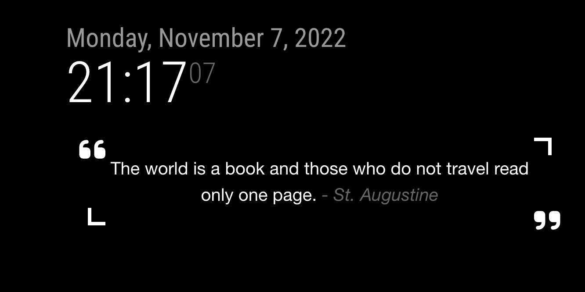

# Module: MMM-GoodreadsQuotes

Displays quotes from your chose authors on Goodreads. This is a module for the [MagicMirror²](https://github.com/MichMich/MagicMirror) project.

## Installation
1. Navigate to the `MagicMirror/modules` directory.
2. Execute `git clone https://github.com/IgniparousTempest/MMM-GoodreadsQuotes.git`
3. Configure the module as per below.
4. Restart MagicMirror

## Using the module

Add this to the `/config/config.js` file:

    {
        module: "MMM-GoodreadsQuotes",
        position: "top_left",
        config: {}
    },

Copy the parent folder to `/modules/`.

## Configuration options

The following properties can be configured:

| Option              | Description                                                                                                                                                                   |
|---------------------|-------------------------------------------------------------------------------------------------------------------------------------------------------------------------------|
| `quotesUrls`        | A list of quotes pages to scrape.    **Possible values:** list of URLs   **Default value:** `['https://www.goodreads.com/author/quotes/6819578.Augustine_of_Hippo']` |
| `updateInterval`    | How frequently a new quote is retrieved in seconds. `86400` would be once ber day.    **Possible values:** `1` to positive infinity   **Default value:** `60`        |

## In action

## Notes

This module is written in typescript, as such the javascript files in the root are automatically generated, the actual source code is in [/src](./src).

Goodreads has deprecated their public API, so this module scrapes the Goodreads webpage. As a result if the webpage changes in someway, this module will stop working.
